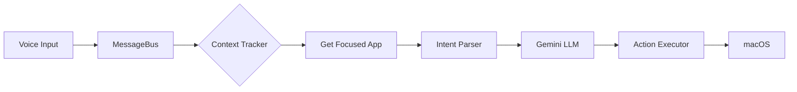

# Context-Aware Voice Control - Implementation Walkthrough

## Summary

Implemented a dynamic voice control system that replaces static commands with LLM-interpreted, context-aware actions.

## Files Created

| File | Purpose |
|------|---------|
| `backend/context_tracker.py` | Monitors focused macOS app via PyObjC |
| `backend/intent_parser.py` | Gemini-based utterance → action parser |
| `backend/action_executor.py` | Executes keystrokes/shortcuts/commands |
| `CHANGELOG.md` | Project changelog |

## Files Modified

| File | Changes |
|------|---------|
| `backend/start_messagebus.py` | Integrated all components, context polling |
| `backend/requirements.txt` | Added PyObjC and Gemini dependencies |

## Architecture



## Verification

✅ **Context Tracker**: Correctly detected focused app  
✅ **Dependencies**: All PyObjC and Gemini packages installed  
⚠️ **Gemini API**: Requires `GEMINI_API_KEY` env var (fallback parser works without it)

## How to Run

```bash
# Full mode (with Gemini)
export GEMINI_API_KEY="your-api-key"
./start.sh

# Mock mode (no API key)
./start.sh --mock
```

## Example Workflow

| Utterance | Context | Action |
|-----------|---------|--------|
| "Open Calculator" | Any | Opens Calculator app |
| "3 by 3" | Calculator | Types `3*3` |
| "equals" | Calculator | Presses Enter |
| "Open Notes" | Any | Opens Notes |
| "write hello" | Notes | Types `hello` |
