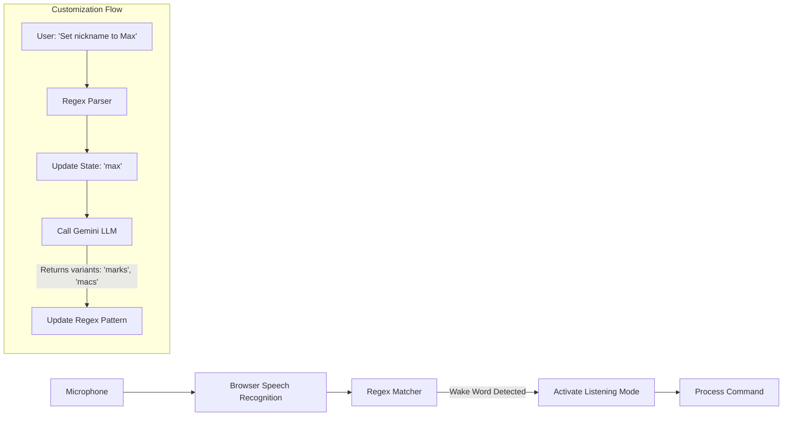

# Dynamic Wake Word & Customization Walkthrough

## Summary

Implemented **customizable wake word listener** ("Ayo" default) with **LLM-powered variant generation** for robust detection.

## New Features (v0.3.0)

1.  **Custom Wake Word**: "Set nickname to Max" via voice.
2.  **Dynamic Variants**: Uses Gemini LLM to generate phonetically similar words (e.g., "Max" -> "marks", "macs") for better accuracy.
3.  **Persistence**: Wake word and variants saved to `localStorage`.
4.  **Visual Feedback**: VoiceOrb displays current wake word (e.g., 'SAY "MAX"').

## Files Involved

| File | Purpose |
|------|---------|
| `App.tsx` | Main logic for wake word state, LLM generation, and regex matching |
| `backend/wake_word_listener.py` | OpenWakeWord listener (defaults to "hey_jarvis" model as placeholder for "Ayo") |
| `backend/intent_parser.py` | Updated regex to support "Ayo" and common variants |

## Usage

### Setting a Custom Wake Word
Say: **"Set nickname to [Name]"**
*   Example: "Set nickname to Jarvis"
*   Example: "Call me HAL"

The system will:
1.  Update the wake word state.
2.  Call Gemini LLM to generate phonetic variants.
3.  Update the detection regex dynamically.

### Triggering
Say: **"[Name] open calculator"**
*   Example: "Jarvis open calculator"
*   Example: "Ayo open calculator" (if default)

## Architecture

> **Note**: The backend `wake_word_listener.py` provides a secondary wake word channel using OpenWakeWord, but primarily we use the browser-based dynamic regex for flexibility with custom names.
